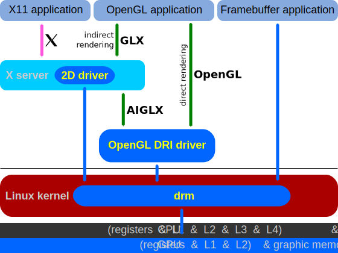

# battlebuds
Learning Zig, ~~Libdrm~~ ~~XCB~~ SDL2 and HID controller interfacing by making a game.

This is for educational purposes for the forseeable future.

Developing in WSL2 with x86_64 architecture.
```
    $ uname -a

Linux J 5.15.153.1-microsoft-standard-WSL2 #1 SMP Fri Mar 29 23:14:13 UTC 2024 x86_64 x86_64 x86_64 GNU/Linux
```


# TODO list to get started:

Functionality: 

- [X] Figure out basics of Zig build system.
- ~~[ ] Draw anything to a buffer with libdrm.~~
- ~~[X] Draw anything to a window using XCB.~~
- ~~[ ] Draw pixmaps with XCB.~~
- [X] Draw anything with SDL2.
- [X] Correctly draw a texture to screen.
- [ ] Read input from controller (hidapi).
- [ ] Create a loop to move some shape based on controller input.
- [ ] Move multiple (displayed) objects at once.
- [ ] Create basic collision detection
- [ ] Add basic Newtonian physics.
- [ ] Research options for PRNG numbers in Zig/C. 
- [ ] (*) Implement framerate control.
- [ ] (.) Design player character.

Performance: 

- [ ] Investigate Zig vectors with automatic SIMD.
- [ ] Threading.
- [ ] (?) Hardware acceleration (excuse to learn CUDA, look into [GEM/libgbm](https://manpages.debian.org/unstable/libdrm-dev/drm-memory.7.en.html)).

Art: 

- [ ] Make some static pixel art.
- [ ] Make pixel art for animation frames.
- [ ] (*) Add frame count based animations
- [ ] (.) Animation switch on charater mode.
- [ ] (?) Fancy 3D/2.5D background or something, game will still be 2D.


# NOTES DURING DEVELOPMENT
### Libdrm and XCB
Tried using libdrm at first, but as far as I can tell, it's not possible (without some custom magic compatability layers) inside WSL2 because 
the Linux kernel does not have permission to control the framebuffers *just like that*. Thus, I've switched to XCB, and after banging my head
at a wall for a bit, it seems we can get this to work. XCB is at least somewhat low level, and does teach me stuff about C programming and the
X protocol, but it's not the ideal experience of writing directly to framebuffers. It would have been cool to learn about double buffering, page-flipping
and other low level graphics driver stuff, so I might make that when I get access to an actual Linux machine.

<div align="center">
    
    <br>Overview of some parts of the Linux graphics stack.<br><br>
</div>

Basically I'm writing an X11 application, but I will not be using any premade graphics libraries, and only really using 
XCB for window management and sending requests to draw my pixels (which I will write other code to do).
The point is the excercise of it all.

### MIT-SHM
As far as I can tell, using the shared memory extension will not work on WSL2.
https://www.x.org/releases/current/doc/xextproto/shm.html
Concluded this after running:
```sh
xdpyinfo -ext MIT-SHM
```
to get information about the Shm XCB extension. Haven't actually tried though.

### XCB and SDL2
After struggling with XCB for a while, I am moving on to using SDL2. XCB documentation is a bit lacking in some areas, 
and I was not able to find good enough examples for pixmap drawing, mostly running into issues of formatting the data
buffer correctly. I ended up trying the XCB extension xcb_image.h, but even with the helper functions it provides the
pixmap format did not seem to be correct. The specific documentation on drawing pixmaps is missing from the XCB documentation.
I could only find people drawing bitmaps, or using other image formats. A considerable amount of trouble also came from
the C Zig interop, which I am still learning. It's not as easy as some would suggest to get the correct types at the 
current time, especially when there are opaque types and such. Thus, I am switching to using a Zig binding for SDL2,
since I am getting a bit bored of difficult C interop without enough documentation for my current knowledge level.
I the process I did watch this talk: [How to Use Abstraction to Kill Your API - J. Marler](https://www.youtube.com/watch?v=aPWFLkHRIAQ),
so I might take a look at [ZigX](https://github.com/marler8997/zigx) in the future. But for now [SDL2](https://github.com/ikskuh/SDL.zig).

### SDL2 and HIDAPI
It appears the Zig bindings for SDL2 that I'm using don't yet cover the SDL_hid* functions, so I'm using libhidapi directly,
with the libusb-1.0 backend.

### USB permissions
Added a template rule file to be put in /etc/udev/rules.d/ for usb access without `sudo`. I wasn't working at first,
after running the `sudo udevadm control --reload-rules` and `sudo udevadm trigger` commands in a restarted terminal.
Mucked around with different variations of the rule, but after restarting WSL2 in the other terminal I was using as well, 
and reloading the rules again, suddenly it worked. I'm assuming it had something to do with USB passthrough to WSL2,
rule loading and some interaction between those when restarting terminals. Basically, it's probably best to just add
the rule, plug out the device, restart WSL2 terminals or Ubuntu and then reloading the rules just to be safe.

# Dependencies:
- Zig (using 0.14.0)
- SDL2 `sudo apt install libsdl2-dev`
- libusb-1.0 `sudo apt install libusb-1.0.0-dev`
- hidapi `libhidapi-dev`
- ~~libxcb~~
- ~~libxcb-image `sudo apt install libxcb-image0-dev`~~
- ~~libdrm (if missing: `sudo apt install mesa-common-dev libglu1-mesa-dev`)~~
