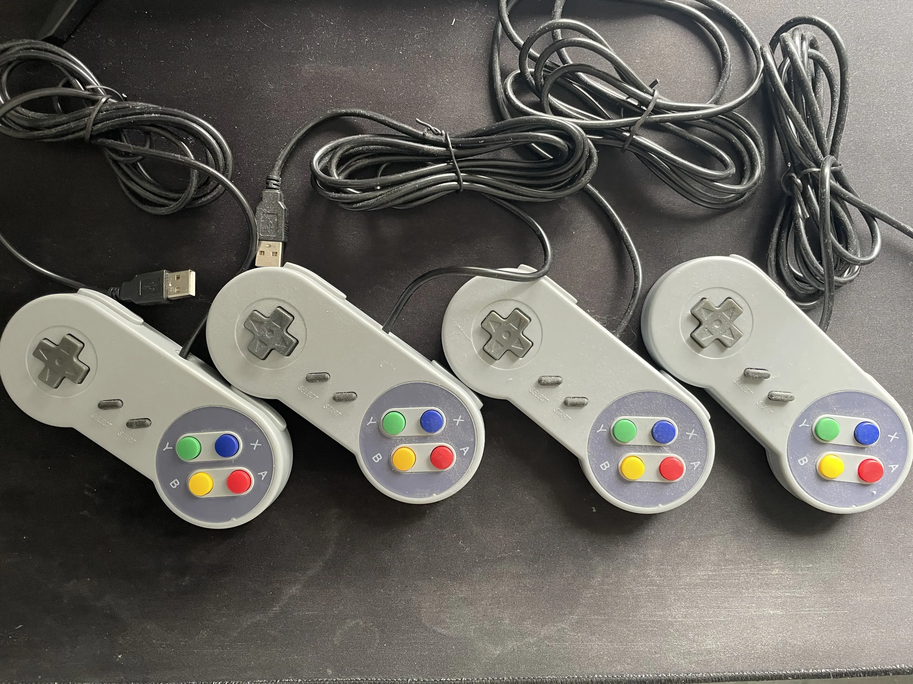
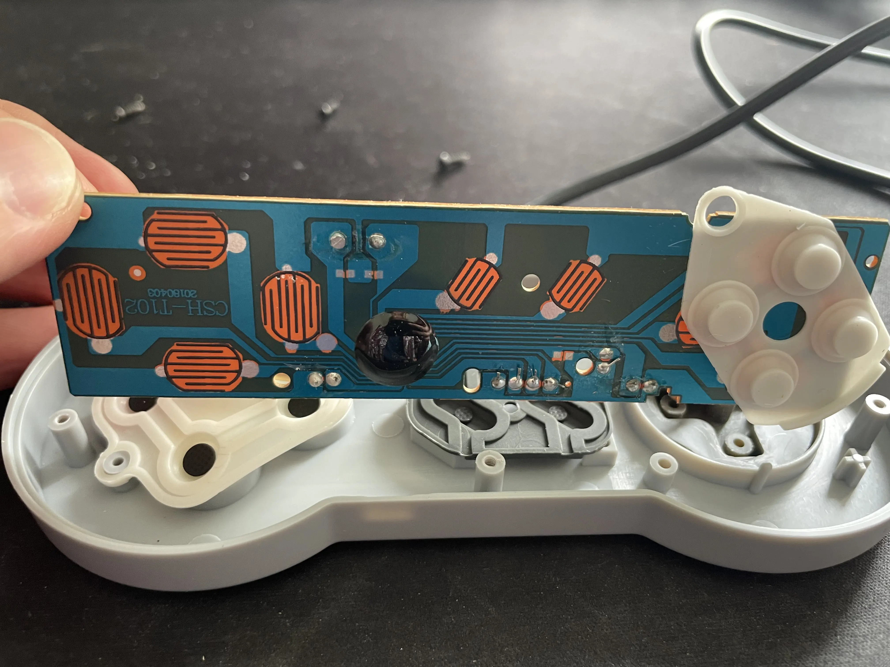
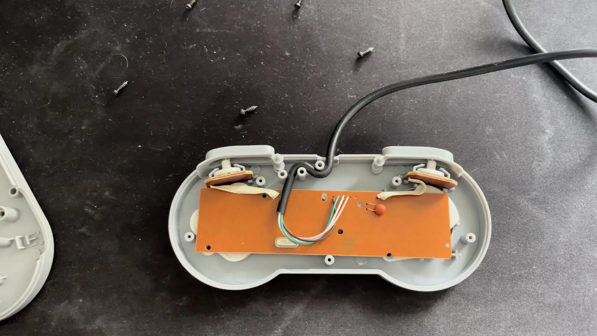

# battlebuds
Learning Zig, ~~Libdrm~~ ~~XCB~~ SDL2 and HID controller interfacing by making a game.

This is for educational purposes for the forseeable future.

Developing in WSL2 with x86_64 architecture.
```
    $ uname -a

Linux J 5.15.153.1-microsoft-standard-WSL2 #1 SMP Fri Mar 29 23:14:13 UTC 2024 x86_64 x86_64 x86_64 GNU/Linux
```


# TODO list to get started:

Functionality: 

- [X] Figure out basics of Zig build system.
- ~~[ ] Draw anything to a buffer with libdrm.~~
- ~~[X] Draw anything to a window using XCB.~~
- ~~[ ] Draw pixmaps with XCB.~~
- [X] Draw anything with SDL2.
- [X] Correctly draw a texture to screen.
- [X] Read input from controller (hidapi).
- [X] Create a loop to move some shape based on controller input.
- [ ] Move multiple (displayed) objects at once.
- [ ] Create basic collision detection
- [ ] Add basic Newtonian physics.
- [ ] Research options for PRNG numbers in Zig/C. 
- [ ] (*) Implement framerate control.
- [ ] (.) Design player character.

Performance: 

- [ ] Investigate Zig vectors with automatic SIMD.
- [ ] Threading.
- [ ] (?) Hardware acceleration (excuse to learn CUDA, look into [GEM/libgbm](https://manpages.debian.org/unstable/libdrm-dev/drm-memory.7.en.html)).

Art: 

- [ ] Make some static pixel art.
- [ ] Make pixel art for animation frames.
- [ ] (*) Add frame count based animations
- [ ] (.) Animation switch on charater mode.
- [ ] (?) Fancy 3D/2.5D background or something, game will still be 2D.


# NOTES DURING DEVELOPMENT
### Libdrm and XCB
Tried using libdrm at first, but as far as I can tell, it's not possible (without some custom magic compatability layers) inside WSL2 because 
the Linux kernel does not have permission to control the framebuffers *just like that*. Thus, I've switched to XCB, and after banging my head
at a wall for a bit, it seems we can get this to work. XCB is at least somewhat low level, and does teach me stuff about C programming and the
X protocol, but it's not the ideal experience of writing directly to framebuffers. It would have been cool to learn about double buffering, page-flipping
and other low level graphics driver stuff, so I might make that when I get access to an actual Linux machine.

<div align="center">
    
    <br>Overview of some parts of the Linux graphics stack.<br><br>
</div>

Basically I'm writing an X11 application, but I will not be using any premade graphics libraries, and only really using 
XCB for window management and sending requests to draw my pixels (which I will write other code to do).
The point is the excercise of it all.

### MIT-SHM
As far as I can tell, using the shared memory extension will not work on WSL2.
https://www.x.org/releases/current/doc/xextproto/shm.html
Concluded this after running:
```sh
xdpyinfo -ext MIT-SHM
```
to get information about the Shm XCB extension. Haven't actually tried though.

### XCB and SDL2
After struggling with XCB for a while, I am moving on to using SDL2. XCB documentation is a bit lacking in some areas, 
and I was not able to find good enough examples for pixmap drawing, mostly running into issues of formatting the data
buffer correctly. I ended up trying the XCB extension xcb_image.h, but even with the helper functions it provides the
pixmap format did not seem to be correct. The specific documentation on drawing pixmaps is missing from the XCB documentation.
I could only find people drawing bitmaps, or using other image formats. A considerable amount of trouble also came from
the C Zig interop, which I am still learning. It's not as easy as some would suggest to get the correct types at the 
current time, especially when there are opaque types and such. Thus, I am switching to using a Zig binding for SDL2,
since I am getting a bit bored of difficult C interop without enough documentation for my current knowledge level.
I the process I did watch this talk: [How to Use Abstraction to Kill Your API - J. Marler](https://www.youtube.com/watch?v=aPWFLkHRIAQ),
so I might take a look at [ZigX](https://github.com/marler8997/zigx) in the future. But for now [SDL2](https://github.com/ikskuh/SDL.zig).

### SDL2 and HIDAPI
It appears the Zig bindings for SDL2 that I'm using don't yet cover the SDL_hid* functions, so I'm using libhidapi directly,
with the libusb-1.0 backend.

### USB Permissions
It turns out my device didn't have the udev ATTR bInterfaceClass, so I needed to match on the vendor and product ids.
Also needed to either give all users read-write access, or give read-write access to the "plugdev" group, or to the
group of my username.

### HIDAPI and Controllers
I was a bit worried at first that I would need to reverse engineer the usb input report packages sent by the bootleg
controllers:
<div align="center">
    
    <br>Four unknown controllers I found in some electrical waste (still packaging plastic).<br><br>
</div>
So I opened one of them to see if I could find some information about who made these:<br><br> 

<div align="center">
    
    
    <br>Inside of the controllers.<br><br>
</div>
I could not.<br><br>

Luckily however, an super useful tool called [hidviz](https://github.com/hidviz/hidviz) allowed me to confirm that
whoever made these controllers did follow some HID standards, giving information on the bits in the usb reports from the device.
Thus I can pack the received bytes into a nice Zig packed struct.
```Zig
const UsbGamepadReport = packed struct {
    x_axis: u8, // left: 0, middle: 127, right: 255
    y_axis: u8, // down: 0, middle: 127, up: 255
    padding_0: u24,
    padding_1: u4,
    X: u1,
    A: u1,
    B: u1,
    Y: u1,
    L: u1,
    R: u1,
    button6: u1, // unused
    button7: u1, // unused
    select: u1,
    start: u1,
    unknown: u10,
}; // 64 bits
```
```Zig
const hid = @cImport(@cInclude("hidapi.h"));
const report_bytes = 8;
var data: [report_bytes]u8 = undefined;
const retval = hid.hid_read(hid_dev, &data, report_bytes)
const report_struct: *UsbGamepadReport = @ptrCast(@alignCast(&data));
```

### Character Control Design
Because the d-pad sensor is a bit rough, and often gets both horizontal and vertical inputs when pressing,
we can work around the issue by not using the vertical direction, and just have horizontal movement
with a button press for jumping.

### Zig Function Parameters
As it happens, when passing a value to a function, Zig choose whether to copy or pass a reference
to the parameter, depending on which is faster. This is possible because Zig function parameters are immutable,
and one should treat all parameters as being copied values. 
[Pass-by-Value Parameters](https://ziglang.org/documentation/master/#toc-Pass-by-value-Parameters).

Thus, math functions that take large `@Vector`s don't need to worry about expensive copies, so this is fine:
```Zig
fn elementwiseAddition(vec1: @Vector(99999, f64), vec2: @Vector(99999, f64)) @Vector(99999, f64) {
    return vec1 + vec2;   
}
```

### Zig init() Idiom When Trying not to Heap Allocate
To avoid dangling pointers when initializing pointer fields in a struct through an init()
method, we need to pass the pointer to the init function, for the address to valid after the
end of the function scope. This greatly displeases me :) and looks too much like C for my liking.
[GitHub issue comment](https://github.com/ziglang/zig/issues/13640#issuecomment-1333098517)

There are some proposals that will change this:
[Result Locations](https://github.com/ziglang/zig/issues/2765)
[Pinned Structs](https://github.com/ziglang/zig/issues/7769)

### Separating Axis Theorem
To allow for more shapes than just rectangles and circles I've upgraded the collision detection to use
the separating axis theorem, implemented with @Vectors for parallellism. This should give me faily good performance,
but the tradeoff is that making spatial optimizations now becomes a bit tricky, since we check everything against
everything with SIMD operations, and thus also can't have early exit from the detection loop 
(could actually sum-reduce the vector to check if everything is not colliding and exit early if so). On the other hand, this mean the performance we
see is consistent and always worst-case. It should still be possible to implement uniform grid optimizations
for collision testing, but I doubt it will be necessary.

### Artwork and Music
After having working collision detection (that I'm happy with), we can now make our first stage,
and I've gone for a space theme because it's one of the easier to draw. My friend August also offered 
to make some music for the game, so now it really feels like we're getting somewhere.

<div align="center">
    
    <br>Space stage background. Made in ProCreate<br><br>
</div>
We'll figure out the artstyle as we go. It's been a while since I did any art, so I'll have to re-learn.

# Dependencies:
- Zig (using 0.14.0)
- SDL2 `sudo apt install libsdl2-dev`
- libusb-1.0 `sudo apt install libusb-1.0.0-dev`
- hidapi `libhidapi-dev`
- ~~libxcb~~
- ~~libxcb-image `sudo apt install libxcb-image0-dev`~~
- ~~libdrm (if missing: `sudo apt install mesa-common-dev libglu1-mesa-dev`)~~
